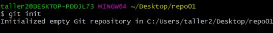
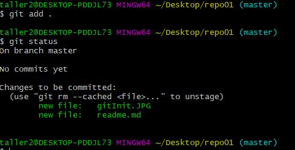
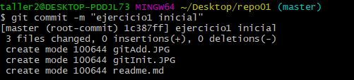
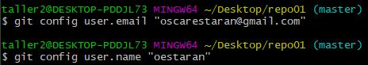

# Manual comandos Markdown

## Repositorio local

Para crear un repositorio local usaremos el comando "**git init nombreDelRepositorio**".  
  
Una vez tengamos cierto trabajo realizado, para realizar una snapshot seguimos los siguientes pasos:  
1. Hacemos un "**git add nombreDelFichero**" para añadir el fichero para realizar la captura, o "**git add .**" para añadir todos los ficheros añadidos o modificados.  
2. Una vez añadidos en el stagging area, realizamos un "**git status**" para comprobar los archivos listos para la captura.  
  
3. Una vez aquí, para crear la captura añadimos "**git commit -am "descripción para la snapshot"**" y tendremos la primera versión guardada correctamente.  

## Repositorio remoto  

- Primero configurar el usuario y el correo con los siguientes comandos:  
  
- Y con el comando "**git push**" añadimos los archivos al repositorio remoto.